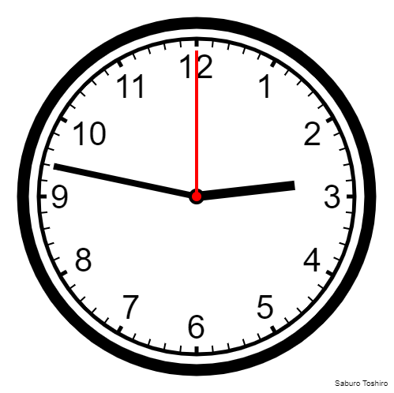

# js-canvas-clock

Hi there! 

I created this project to try trigonometric functions in practice. In the preview image below, you can see what a working clock looks like after opening the clock.html file  
Feel free to use my code and modify it as you see fit if you want!

|||
|-|-|
| Author: | Filip Janoušek |
| Alias: | Saburo Toshiro |
| Time: | ~ 8 hours |

